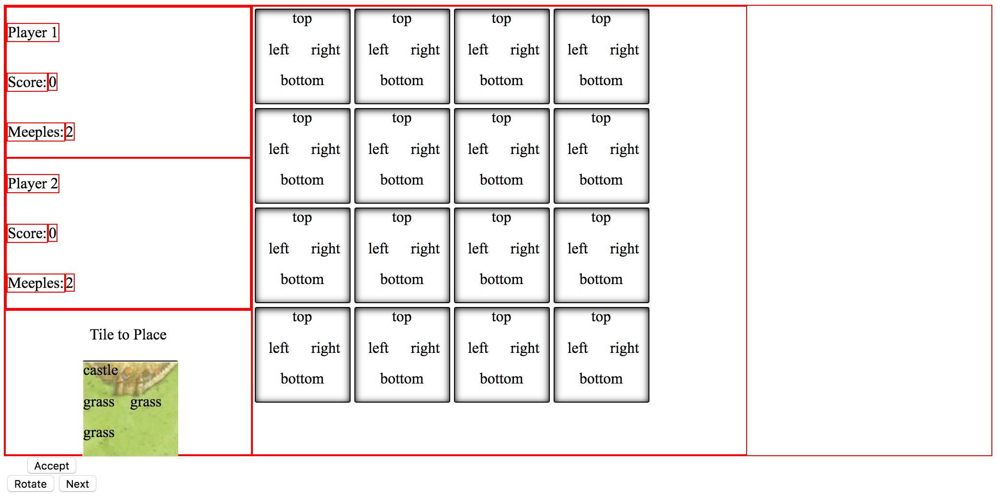

Originally set out to make Carcassonne Game with just the Castle pieces

#Progress Pictures: 

##Planned Trello Board
My mockups before starting the project

## Day 2
Early drafts of the game. Use red border to get an idea of how elements will look around each other

## Day 5
Progress after three days, mostly spent working on the javascript. Images and Meeples added. Slowly worked in elements such as buttons

## Day 7
After working several hard days at the javascript, had some fun on this day to work on the front end. Tried several  looks. 

## Day 9
Added finishing touches and last front-end changes

Last change added darker background to complement the Title words.

# Technologies Used
* jquery
* sweetalerts

# Approach Taken
* Started by building a basic board
	* partial layout to look like markup
* Get a player turn locked down
	* New tiles & board dynamically generate
	* Tiles rotate and representated on both HTML and JS side
* Integrated graphics
	* Rotation to correctly reflect rotation
* Logic for castle completion
	* Had to change how I executed the function, led to re-coding tile representations in code

# Issues
* Learning jquery
* Getting rotations to reflect correctly, the tile is split into four divs that were rotating with the image rotation.
* activating/deactivating event listeners
* stuck on castle check for 3 days

# Fun Stuff
* Styling
* Refactoring 

# Unsolved Problems
* the algorithm that checks for connected castle pieces does not handle for two castles that are on a tile but are not connected. Because the algorithm returns on a broken castle, if one of the castles were not complete, the function would end before getting a chance to check the second castle.
* Check for comleted castles is buggy, large castles seem to believe they are complete and assign points before they are actually complete.

# Next Steps
* alert user of points received
* fix bugs
* add roads
* additional styling

# Resources Used:
* Blue Meeples: https://www.thegamecrafter.com/parts/meeple-blue
* Red Meeples: https://www.thegamecrafter.com/parts/meeple-red
* Blue player background: https://pixabay.com/en/background-blue-1984434/
* Red player background: https://pixabay.com/en/backgrounds-background-structure-1932040/
* Parchment paper: https://pixabay.com/en/paper-certificate-grunge-antique-1217311/
* Buttons: https://studio87blog.files.wordpress.com/2016/01/white-marble-2048.jpg
* Wood backgrounds: https://pixabay.com/en/photos/?image_type=&cat=&min_width=&min_height=&q=wood+background&order=popular
* background wood: https://pixabay.com/en/dark-marron-wood-smooth-clear-1932208/
* dark wood: https://pixabay.com/en/funds-wood-smooth-clear-texture-1932210/
* Tile set: http://russcon.org/RussCon/carcassonne/tiles.html
* font: https://fonts.google.com/specimen/MedievalSharp
* BGM: https://static.chronocompendium.com/Black/Music%20(Chrono%20Trigger)/Compendium/RPGamer/CorridorsofTime(MathewValente).mp3