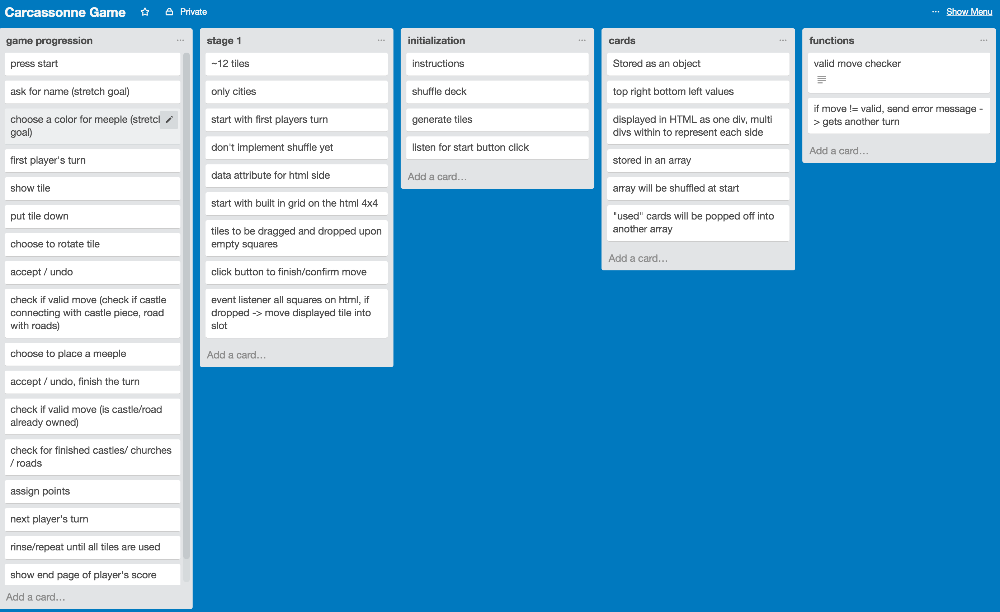
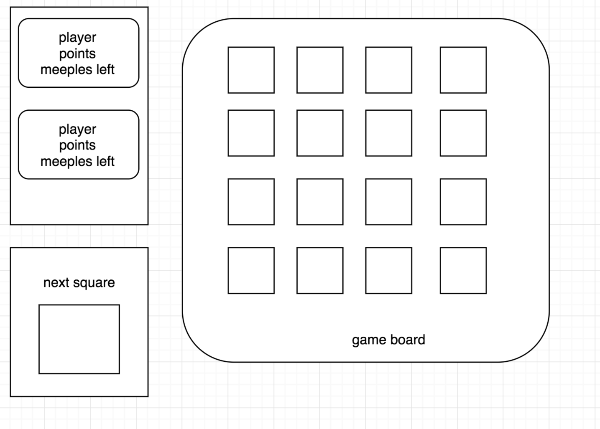

Originally set out to make Carcassonne Game with just the Castle pieces

Process: 
Planned Trello Board:

technologies used: jquery, sweetalerts

approach taken
started by building a basic board

get a player turn locked down

stuck on castle check for 3 days

styling was fun
refactoring was fun

unsolved problems
the algorithm that checks for connected castle pieces does not handle for two castles that are on a tile but are not connected. Because the algorithm returns on a broken castle, if one of the castles were not complete, the function would end before getting a chance to check the second castle.

Resources:
Blue Meeples: https://www.thegamecrafter.com/parts/meeple-blue
Red Meeples: https://www.thegamecrafter.com/parts/meeple-red

Blue player background: https://pixabay.com/en/background-blue-1984434/
Red player background: https://pixabay.com/en/backgrounds-background-structure-1932040/

Parchment paper: https://pixabay.com/en/paper-certificate-grunge-antique-1217311/
Buttons: https://studio87blog.files.wordpress.com/2016/01/white-marble-2048.jpg
Wood backgrounds
background wood: https://pixabay.com/en/dark-marron-wood-smooth-clear-1932208/
dark wood: https://pixabay.com/en/funds-wood-smooth-clear-texture-1932210/
https://pixabay.com/en/photos/?image_type=&cat=&min_width=&min_height=&q=wood+background&order=popular

Tile set: http://russcon.org/RussCon/carcassonne/tiles.html - tiles

font: https://fonts.google.com/specimen/MedievalSharp

BGM: https://static.chronocompendium.com/Black/Music%20(Chrono%20Trigger)/Compendium/RPGamer/CorridorsofTime(MathewValente).mp3